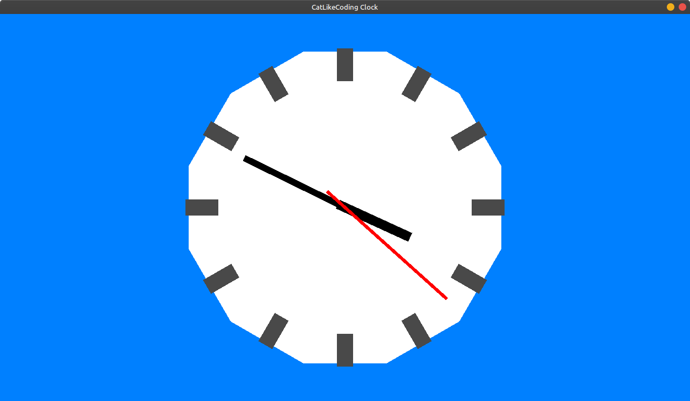

# Coffee Engine Test

This is a companion application for testing functionalities of 
[CoffeeEngine](https://github.com/Crosslywere/CoffeeEngine)

## Tests The Following

- Camera3D
  - Movement (through Entity.Transform)
  - Rotation (through Entity.Transform)
  - Custom Framebuffer Shader
  - Making Active
  - Rendering
- Entity
  - Rendering

## Implemented Projects

1. [CatLikeCoding](https://catlikecoding.com/unity/tutorials/basics/game-objects-and-scripts/)

The implementation was subpar due to:
   - Repeated shader usage (Default entity shaders)
   - Repeated mesh usage (Look into instancing)
   - Long constructor